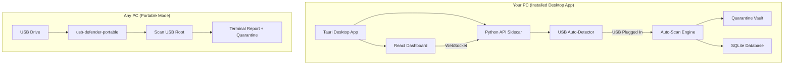

# USB-Defender

*A cross-platform security ecosystem for real-time USB malware detection, quarantine, AI-powered analysis, and beautiful visualization.*

**USB-Defender** protects you from malicious files hiding in USB drives. It comes in two interconnected parts:
1. **The Desktop App (Command Center):** A sleek, modern GUI that lives on your PC. It auto-detects USB insertion, runs background scans, and provides a beautiful dashboard to manage quarantined files.
2. **The Portable Scanner:** A standalone, zero-dependency executable that lives *on the USB drive itself*, protecting the drive when you plug it into *other* people's untrusted machines.

---

## Features

### 1. The Desktop Command Center (Tauri + React + Python)
- **Zero-Click Auto-Scan:** Automatically detects when a USB drive is plugged in and scans it silently in the background.
- **Beautiful Dashboard:** Real-time threat feed, severity distribution charts, and historical logs.
- **Quarantine Vault:** Safely decrypt and restore files that were mistakenly flagged, right from the UI.
- **"Arm USB" Button:** One-click deployment of the Portable Scanner directly to your USB drive.

### 2. The Portable USB Engine
- **True Portability:** Native binaries for Windows (`.exe`) and Linux (`ELF`), plus a zero-dependency Python fallback. No installation required on the target machine.
- **Gemini AI Threat Verification:** Uses Google's Gemini 2.5 Flash to act as a cybersecurity analyst, analyzing flagged files to verify if they are truly malicious or just false positives (like developer scripts).
- **Safe XOR Quarantine:** High-severity threats are instantly neutralized using Symmetric XOR Encryption, preventing accidental execution.
- **Developer-Friendly Heuristics:** Automatically ignores `.git` and `node_modules` to eliminate false positives on development projects.

---

## Architecture



---

## Installation & Usage

### Option 1: The Desktop App
Download the installer for your platform from the **[Releases](../../releases)** page.

* **Windows:** Download and run the `.msi` installer.
* **Linux:** Download the `.deb` or `.rpm` package and install via your package manager.
* **macOS:** Download the `.dmg` (coming soon).

Once installed, simply open USB Defender and plug in a USB drive!

### Option 2: The Portable Scanner
If you just want to protect a specific USB drive:
1. Open the **Desktop App** and go to the **Scanner** tab.
2. Select your USB drive and click **"Arm USB"**. 
3. *Alternatively:* Download the portable binaries from the Releases page and copy them to the root of your USB drive manually.

**Using the Portable Scanner on a friend's PC:**
* **Windows:** Double-click `USBDefender.exe` or run `scan.bat`.
* **Linux:** Run `./usb-defender-linux` or `./scan.sh`.
* **Any OS:** Run `python3 usb_defender_portable.py`.

The scanner will present an interactive terminal menu allowing you to scan the drive, use Gemini AI, or restore quarantined files.

---

## Development Setup

Want to build USB-Defender from source?

**1. Clone the repository:**
```bash
git clone https://github.com/ZyAzOsK/USB-defender.git
cd USB-defender
```

**2. Setup the Python API Sidecar:**
```bash
python3 -m venv .venv
source .venv/bin/activate  # On Windows: .venv\Scripts\activate
pip install -r requirements.txt
```

**3. Run the Desktop App (Development Mode):**
```bash
cd dashboard
npm install
npm run tauri dev
```

**4. Build the Portable Scanner binaries:**
```bash
python portable/build_portable.py
```

---

## License
This project is licensed under the MIT License. See the [LICENSE](LICENSE) file for details.
